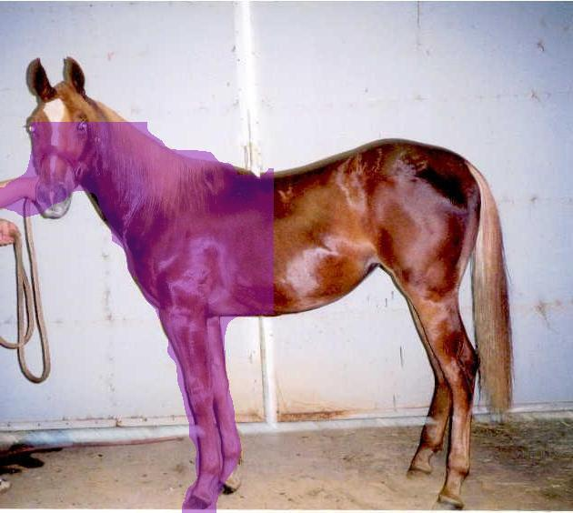

# EasyDL 图像分割测试接口 Java 简易实现

## 测试流程

主程序入口位于 `com.baidu.aip.easydl.segmentation.App`

### 输入参数

* 于 `segmentation-demo/src/main/java/com/baidu/aip/easydl/segmentation/App.java` 的 `App` 类中填写必要参数

  * `ACCESS_KEY` 和 `SECRET_KEY`： 可从 控制台 => 安全认证 中查看

    

    

  * `TOKEN`： 若已申请过，则可直接忽略上一步，直接填写于此。否则，默认为 `null`，同时第一次运行时，在正确填写 `ACCESS_KEY` 和 `SECRET_KEY` 的情况下会自动申请一个新 `TOKEN`。将 `null` 替换为该值即可继续于模型接口交互。

  * `MODEL_URL`： 已经训练好的图像分割模型的接口

    于 发布模型 => 接口地址 中，自定义的该模型的公开接口的 URL

  * `INPUT_FILEPATH`： 输入图像文件路径

  * `OUTPUT_FOLDER` / `OUTPUT_FILENAME`： 输出图像文件夹以及文件名

### 构建 / 运行

于 `segmentation-demo/` 文件夹下

* Maven

    https://maven.apache.org/download.cgi 下载 Maven 的 Binary zip archive, 如 `apache-maven-3.6.3-bin.zip` 

    安装 Maven 参考 https://maven.apache.org/install.html

    完成后， Linux 平台下 于 Bash 中运行 

    ```bash
    $ mvn compile
    $ mvn exec:java
    ```

    Windows 平台下，于 cmd / Powershell 中运行

    ```cmd
    > mvn.cmd compile
    > mvn.cmd exec:java
    ```

* Gradle

    Linux 平台于 Bash 中直接运行 

    ```Bash
    $ ./gradlew run
    ```

    Windows 平台于 cmd / Powershell 中直接运行

    ```cmd
    > ./gradlew run
    ```

* IDE

    直接将此 `src` 文件夹放置于项目中，运行入口类 `App.java` 即可

## 生成结果实例

* 测试图像： `horseTest01.jpg`:

    

* 分割区域0： `horseTest01_segment0.jpg`:

    

* 分割区域1： `horseTest01_segment1.jpg`:

    

* 分割区域2： `horseTest01_segment2.jpg`:

    

* 分割区域3： `horseTest01_segment3.jpg`:

    

* 全部识别区域： `horseTest01_masked_all.jpg`:

    

* 若该图像分割模型未能识别目标对象, 则生成的图像将与原图一致


## 基本原理说明

* 读取原图的字节串，进行 Base64 编码，以 JSON 格式发送 POST 请求至 模型接口

* 以 JSON 格式读取该响应，解析出一个 Mask字符串列表，代表模型识别出目标对象多个区域

* 将每个 Mask字符串 先后进行 6位LEB 以及 RLE 解码，各自生成一个长度为 图像长度 * 图像宽度 的 Boolean 数组

* 遍历 Boolean 数组，其 真值所在的索引 对应了该区域之于原图所在像素点的坐标
