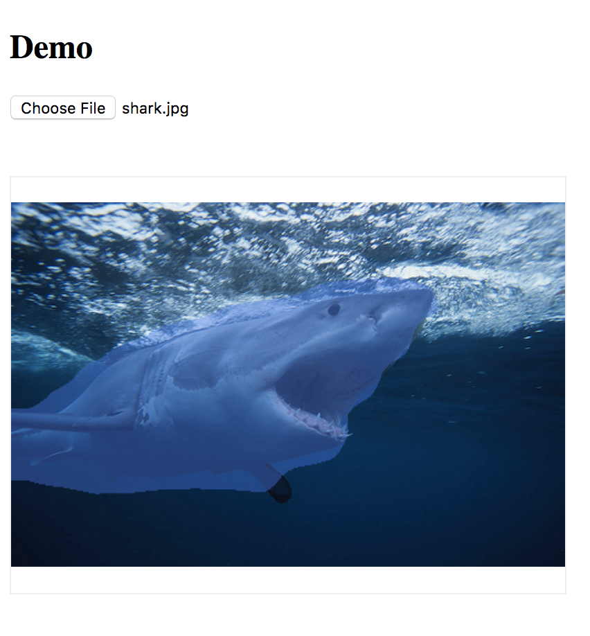

# EasyDL 图像分割 js demo

注意，本项目仅供展示。请勿直接用于生产环境。

## Demo 所体现的内容有

1. 如何使用 AK/SK 换取 Access Token
2. 如何调用 EasyDL API 获取模型的识别结果
3. 如何对 API 中的 mask 进行解码
4. 如何在页面绘制解码后的 mask

## 体验 Demo

#### 1. 修改 `demo/settings.json`

如何获取这些信息请参考 https://cloud.baidu.com/doc/EASYDL/s/Uk232qskm

```json
{
    "api": "<可以在 EasyDL 已发布模型中找到>",
    "ak": "<上述 API 中绑定的 Access Key>",
    "sk": "<上述 API 中绑定的 Access Secret>"
}
```

#### 2. 启动 Demo

确保已安装 Node.js

`node ./demo/demo.js`

#### 3. 浏览器中体验 Demo

浏览器打开 http://localhost:7000 进行体验


