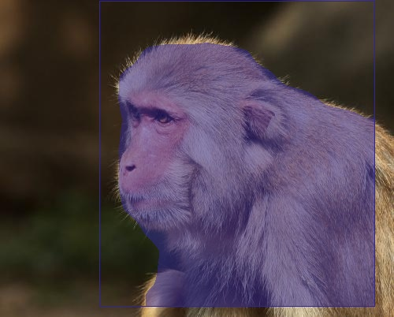

# EasyDL 图像分割 python sdk

## Prerequisites
### python 2.7
### 安装依赖库pycocotools
```pip install cython; pip install pycocotools```

### 安装OpenCV(可选，不需要可视化不用安装，但需要自己修改代码)
```pip install opencv-python```

## Usage
修改request_api.py中的```request_url```, ```access_token```, ```img_path```, 替换为自己的值。

然后执行```python request_api.py```即可

## Demo图
输入图片：


输出图片：



